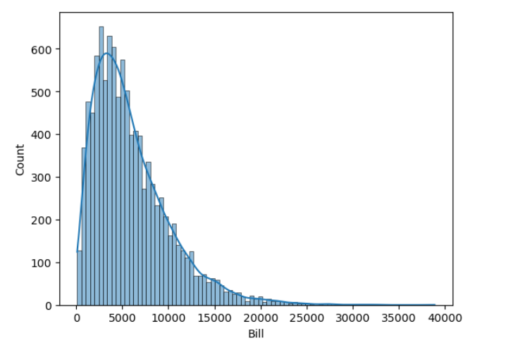
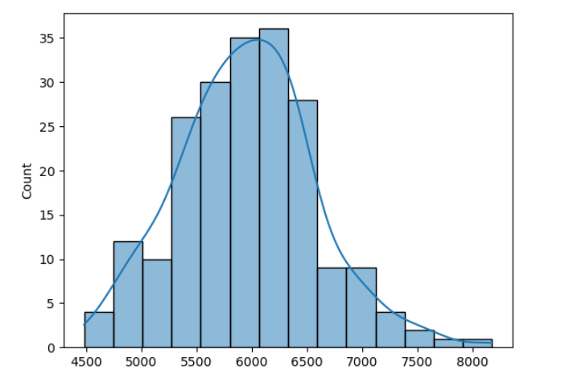

# Visual Demonstration of the Central Limit Theorem (CLT)

This project is a Jupyter Notebook demonstrating the Central Limit Theorem. It visually proves that even if a population's distribution is not normal (e.g., right-skewed or bimodal), the distribution of its sample means will always tend to form a normal distribution (a bell curve).

## Project Objective

The goal is to provide a clear, visual, and practical confirmation of the CLT using two distinct datasets:
1.  A real-world, **right-skewed** dataset of electricity bills.
2.  A synthetic, **bimodal** (two-humped) dataset created with NumPy.

In both cases, the notebook shows the non-normal population and then plots the normally-distributed sampling distribution, confirming the theorem.

## Visual Demonstration

Here is the Central Limit Theorem in action on the electricity bill data.

**1. The Population Distribution (Skewed)**
*(This is the histogram of all 10,350 individual bills. As you can see, it is heavily right-skewed.)*



**2. The Sampling Distribution of the Mean (Normal)**
*(This is the histogram of the 207 sample means. As the CLT predicts, this distribution is perfectly normal, even though the population it came from was skewed.)*



## Technologies Used

* **Python**
* **Pandas:** For data loading and grouping.
* **NumPy:** For generating the synthetic bimodal dataset.
* **Matplotlib & Seaborn:** For plotting all histograms and distributions.

## How to Run This Project

1.  Clone the repository:
    ```bash
    git clone [https://github.com/shru213/python-project-1.git](https://github.com/shru213/python-project-1.git)
    ```
2.  Install the required libraries:
    ```bash
    pip install pandas matplotlib seaborn numpy
    ```
3.  Ensure you have the `bill_survey.csv` file in the same directory.
4.  Run the `central_limit_theorm.ipynb` notebook using Jupyter Lab or Jupyter Notebook.
